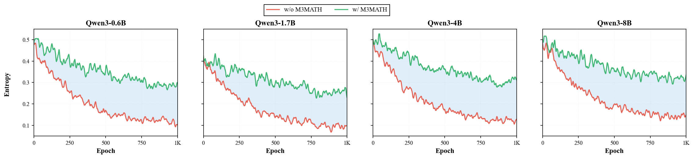

# M3MATH

**M3MATH: A Multiform, Multisubject, and Multilingual Dataset for Enhancing Reasoning Consistency and Diversity**

M3MATH is a dataset for studying and improving the robustness of mathematical reasoning models under semantically equivalent question transformations. It targets a failure mode we call **Question-Type Escape (QTE)**, where a model solves a problem in one presentation but fails when the same mathematical structure is expressed in another form.

The released dataset contains **22,164** validated JSONL records expanded from filtered Omni-MATH-2 seed problems. The transformations cover multiple objective formats, cross-disciplinary contexts, and multilingual variants, providing a compact testbed for evaluating whether models reason over the underlying mathematical structure rather than relying on surface-level cues.

This repository is prepared as an anonymous paper-release repository. Author information and the final citation will be added after de-anonymization.

## Repository Contents

```text
.
|-- README.md
|-- LICENSE
|-- omni-math-diversity.jsonl
`-- assets/
    `-- entropy_curves.png
```

## Dataset

The dataset is stored as newline-delimited JSON:

```text
omni-math-diversity.jsonl
```

Each line is one problem instance with the following fields:

| Field | Type | Description |
| --- | --- | --- |
| `id` | string | Instance identifier, often encoding the seed and transformation type, e.g. `3594_single_choice` or `530_Chemistry`. |
| `problem` | string | The transformed problem statement. |
| `answer` | string | The canonical answer used for evaluation. |

Example:

```json
{
  "id": "3594_single_choice",
  "problem": "Every pair of communities in a county are linked directly by one mode of transportation; bus, train, or airplane. ... Which of the following options is correct?\nA. 6\nB. 3\nC. 4\nD. 5",
  "answer": "C"
}
```

## Loading

```python
import json
from pathlib import Path

path = Path("omni-math-diversity.jsonl")

records = []
with path.open("r", encoding="utf-8") as f:
    for line in f:
        records.append(json.loads(line))

print(len(records))
print(records[0].keys())
```

Expected record count:

```text
22164
```

## Construction Overview

M3MATH is built from challenging and automatically verifiable mathematical seed problems. Each seed problem is expanded along complementary dimensions:

- **Type conversion:** multiple-choice, fill-in-the-blank, and true/false variants.
- **Cross-disciplinary conversion:** equivalent mathematical structures rewritten into domains such as mathematics, physics, chemistry, biology, literature, economics, geography, and history.
- **Multilingual alignment:** English and Chinese variants for evaluating cross-lingual reasoning consistency.

The dataset is designed for both evaluation and reinforcement learning with verifiable rewards, especially in settings where preserving reasoning diversity and cross-form consistency matters.

## Main Results

Pass@1 results on M3MATH and cross-domain benchmarks:

| Model | Setting | M3MATH En | M3MATH Zh | GPQA-Diamond | SuperGPQA | MMLU-Pro |
| --- | --- | ---: | ---: | ---: | ---: | ---: |
| Qwen3-0.6B | w/o M3MATH | 11.6 | 12.5 | 22.9 | 19.4 | 27.4 |
| Qwen3-0.6B | w/ M3MATH | **33.2** | **30.4** | **28.4** | **27.8** | **34.2** |
| Qwen3-1.7B | w/o M3MATH | 18.8 | 19.7 | 28.6 | 23.6 | 45.2 |
| Qwen3-1.7B | w/ M3MATH | **29.4** | **29.7** | **32.8** | **26.1** | **48.3** |
| Qwen3-4B | w/o M3MATH | 41.6 | 43.2 | **41.7** | 32.7 | 57.3 |
| Qwen3-4B | w/ M3MATH | **46.6** | **45.4** | 39.2 | **37.8** | **60.6** |
| Qwen3-8B | w/o M3MATH | 45.4 | 45.9 | 39.3 | 31.7 | 59.6 |
| Qwen3-8B | w/ M3MATH | **49.2** | **50.1** | **42.7** | **35.3** | **62.8** |

## Entropy and Consistency

M3MATH slows policy entropy collapse during RLVR training and improves cross-form consistency:

| Model | Setting | H_init | H_final | Delta H | Consistency |
| --- | --- | ---: | ---: | ---: | ---: |
| Qwen3-0.6B | w/o M3MATH | 0.477 | 0.102 | -78.6% | 0.14 |
| Qwen3-0.6B | w/ M3MATH | 0.481 | 0.299 | -37.8% | 0.32 |
| Qwen3-1.7B | w/o M3MATH | 0.421 | 0.099 | -76.6% | 0.18 |
| Qwen3-1.7B | w/ M3MATH | 0.425 | 0.229 | -46.1% | 0.31 |
| Qwen3-4B | w/o M3MATH | 0.498 | 0.129 | -74.2% | 0.38 |
| Qwen3-4B | w/ M3MATH | 0.502 | 0.312 | -37.9% | 0.47 |
| Qwen3-8B | w/o M3MATH | 0.486 | 0.149 | -69.4% | 0.44 |
| Qwen3-8B | w/ M3MATH | 0.492 | 0.336 | -31.6% | 0.51 |



## Citation

Citation information is currently withheld for anonymous review.

```bibtex
@misc{m3math2026,
  title  = {M3MATH: A Multiform, Multisubject, and Multilingual Dataset for Enhancing Reasoning Consistency and Diversity},
  author = {Anonymous},
  year   = {2026},
  note   = {Citation to be updated after de-anonymization}
}
```

## License

The dataset and repository materials are released under the **Creative Commons Attribution 4.0 International License (CC BY 4.0)**. See [LICENSE](LICENSE) for details.

## Notes

- The dataset is intended for research on mathematical reasoning, robust evaluation, synthetic data construction, and reinforcement learning with verifiable rewards.
- Users should follow the license and attribution requirements of the original Omni-MATH-2 source data where applicable.
- Please verify answer normalization choices before using the dataset as an automatic evaluation benchmark in a new setting.
