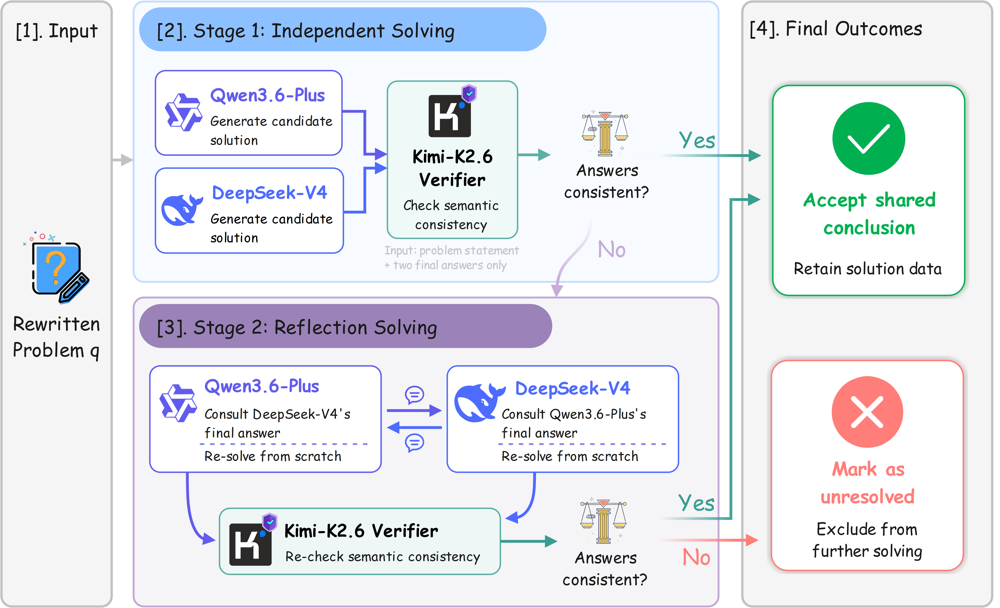
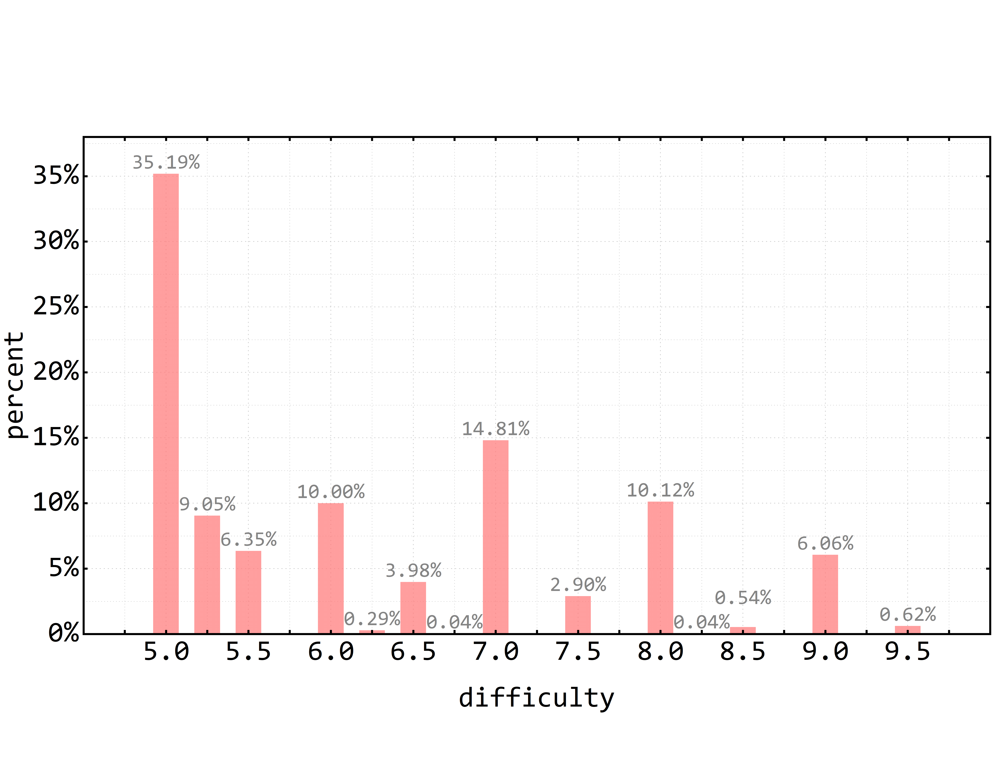
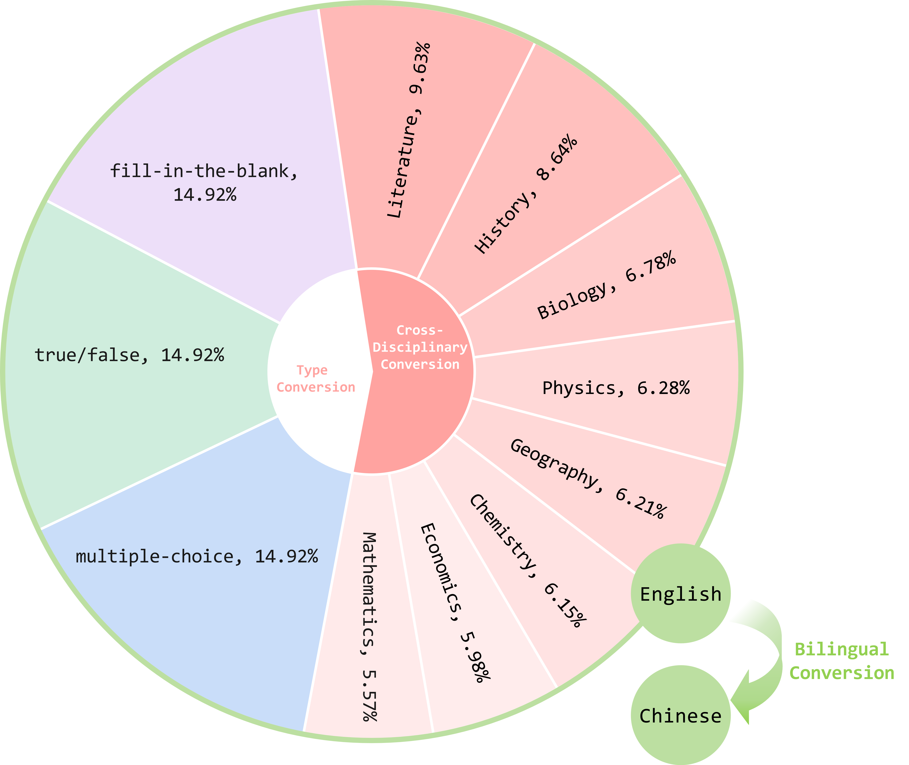
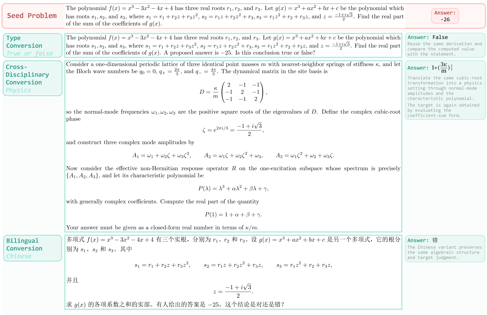

# M3MATH: A Multiform, Multisubject, and Multilingual Dataset for Enhancing Reasoning Consistency and Diversity

## 📖Overview

**M3MATH** is a multiform, multisubject, and multilingual dataset built from challenging and automatically verifiable seed problems in Omni-MATH-2. 

🌟 M3MATH is organized around three transformations: 

- **Type conversion.** Eligible problems are adapted into multiple-choice, fill-in-the-blank, and true/false forms.

- **Cross-disciplinary conversion.** Seed problems are recontextualized by GPT-5.5 into eight disciplines, including mathematics, physics, chemistry, biology, literature, economics, geography, and history, while preserving the same mathematical structure. The converted problems are then screened using the two-stage consensus pipeline, in which Qwen3.6-Plus and DeepSeek-V4 independently solve each problem, followed by Kimi-K2.6 verifying the semantic consistency of their answers. Instances with disagreements that remain unresolved after reflection are discarded.

  <p align="center">
    
  </p>

- **Multilingual conversion.** After the above conversions, each problem is converted into aligned English and Chinese variants.

🌟 **Characterization of seed data and M3MATH composition**. (a) Difficulty distribution of the selected seed problems from Omni-MATH-2-Filtered. (b) Composition of M3MATH. Although each seed problem is initially expanded into eight disciplinary candidate instances, the composition of M3MATH is derived from the final validated dataset rather than from the raw candidate pool.

<p align="center">
  
  
</p>

### 📍Example Instances

<p align="center">
  
</p>

### 📃Data Download

- Data file: [`data/omni-math-diversity.jsonl`](data/omni-math-diversity.jsonl)
- Format: one JSON object per line
- Core fields: `id`, `problem`, `answer`

## 📊Experiments

For both the English and Chinese subsets of M3MATH (M3MATH-en and M3MATH-zh), we split the data into an 80% training set for RLVR and a 20% held-out test set for evaluation. The same split ratio is applied consistently across different question types and disciplinary subjects, ensuring that each subset preserves the overall distribution of formats and domains.

Models: [Qwen3-0.6B](https://huggingface.co/Qwen/Qwen3-0.6B), [Qwen3-1.7B](https://huggingface.co/Qwen/Qwen3-1.7B), [Qwen3-4B](https://huggingface.co/Qwen/Qwen3-4B), [Qwen3-8B](https://huggingface.co/Qwen/Qwen3-8B)

### 🛠️Quick Start

The training and evaluation scripts are provided in [`code/`](code/). Training using the [verl](https://github.com/volcengine/verl).

Before running, prepare `train.parquet` and `test.parquet` under `data/m3math/`, and update the model path in the scripts if your checkpoints are stored elsewhere.

Run CISPO training:

```bash
bash code/train.sh \
  actor_rollout_ref.model.path=/path/to/Qwen3-4B \
  reward.custom_reward_function.path=code/reward.py
```

Run evaluation only:

```bash
bash code/eval.sh \
  actor_rollout_ref.model.path=/path/to/checkpoint \
  reward.custom_reward_function.path=code/reward.py \
  trainer.validation_data_dir=eval_outputs/m3math_eval
```

> The training script uses `actor_rollout_ref.actor.policy_loss.loss_mode=cispo`, samples 5 rollouts per prompt, and trains with the custom verifiable reward. The evaluation script sets `trainer.val_only=True`, uses one deterministic rollout per prompt, and writes validation outputs to the configured `trainer.validation_data_dir`.

### 🔮Main Results

| Model | Setting | M3MATH En | M3MATH Zh | GPQA-Diamond | SuperGPQA | MMLU-Pro |
|---|---|---:|---:|---:|---:|---:|
| Qwen3-0.6B | w/o M3MATH | 11.6 | 12.5 | 22.9 | 19.4 | 27.4 |
| Qwen3-0.6B | w/ M3MATH | **33.2** | **30.4** | **28.4** | **27.8** | **34.2** |
| Qwen3-1.7B | w/o M3MATH | 18.8 | 19.7 | 28.6 | 23.6 | 45.2 |
| Qwen3-1.7B | w/ M3MATH | **29.4** | **29.7** | **32.8** | **26.1** | **48.3** |
| Qwen3-4B | w/o M3MATH | 41.6 | 43.2 | **41.7** | 32.7 | 57.3 |
| Qwen3-4B | w/ M3MATH | **46.6** | **45.4** | 39.2 | **37.8** | **60.6** |
| Qwen3-8B | w/o M3MATH | 45.4 | 45.9 | 39.3 | 31.7 | 59.6 |
| Qwen3-8B | w/ M3MATH | **49.2** | **50.1** | **42.7** | **35.3** | **62.8** |

## 🙏Acknowledgements

We sincerely thank the following open-source projects for providing resources that supported this work:

- [verl](https://github.com/volcengine/verl) for its excellent reinforcement learning framework.
- [vLLM](https://github.com/vllm-project/vllm) for its fast and efficient inference engine.
- [Omni-MATH-2](https://huggingface.co/datasets/martheballon/Omni-MATH-2) for providing the seed data used in this work.
